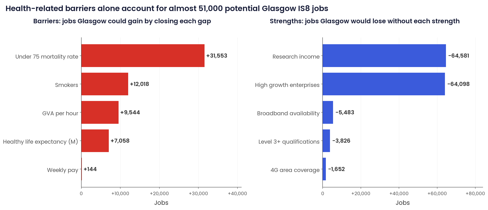
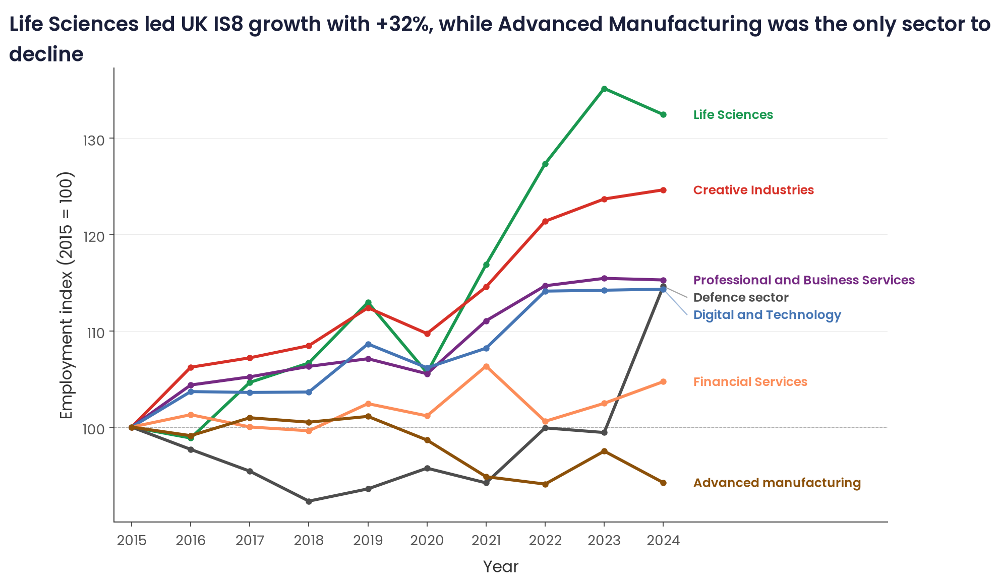
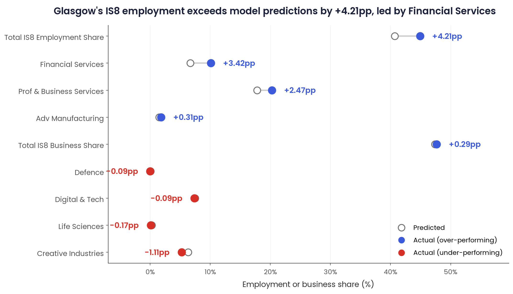
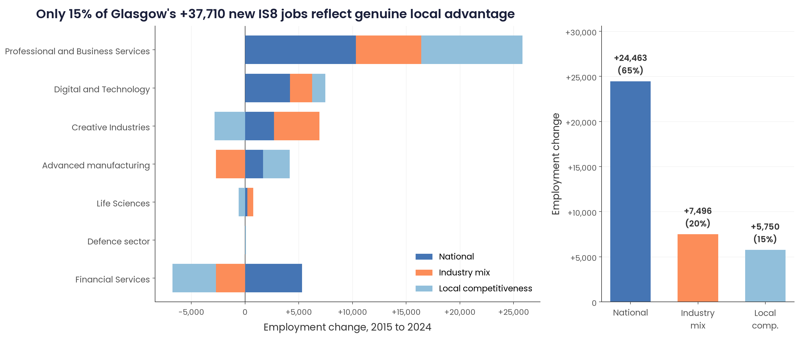

# IS8 industries in the UK and Glasgow City Region

A reproducible analysis of the local conditions that drive industrial sector presence across approximately 350 UK local authorities, with a focused look at where Glasgow City Region exceeds, underperforms, and leaves economic potential on the table.

Based on a group project at the London School of Economics for PP422 (Data Science for Public Policy, Spring 2026), rebuilt end-to-end in Python with reproducible pipelines in scikit-learn, geopandas and matplotlib.



## Context

The UK government's 2025 Industrial Strategy identifies eight sectors with the highest potential for productivity and growth: advanced manufacturing, clean energy industries, creative industries, defence, digital and technologies, financial services, life sciences, and professional and business services. The strategy's success depends on realising this potential in city regions outside London, which have long been identified as the UK's largest source of untapped productivity.

This project asks two questions. First, what local conditions are associated with the presence of these sectors across the UK? Second, how does Glasgow City Region (GCR) compare to what its local conditions would predict, and what does that tell us about where policy intervention could have the greatest effect?

## Key findings

**Nationally, productivity and dynamic business environments predict IS8 presence more than anything else.** Across approximately 350 local authorities, the strongest predictors of IS8 employment share are high-growth enterprise density, Gross Value Added per hour, Level 3+ qualifications, and the under-75 mortality rate. The first three are positive predictors, mortality is negative. The pattern is consistent across most sectors, with exceptions for Life Sciences (which tracks institutional presence more than general local conditions) and Advanced Manufacturing (which clusters in different types of areas than knowledge-intensive services).



**Glasgow's IS8 employment exceeds model predictions by 4.2 percentage points, driven almost entirely by Financial Services and Professional & Business Services.** Glasgow outperforms its predicted IS8 presence overall, with Financial Services alone sitting 3.4pp above model expectations. This overperformance likely reflects the role of anchor institutions in the International Financial Services District (IFSD), including JP Morgan, Barclays, and Morgan Stanley, which generate concentrated employment that the model cannot fully capture from local conditions alone.



**Creative Industries is Glasgow's largest shortfall relative to prediction, representing significant unrealised potential.** Despite being nationally one of the fastest-growing IS8 sectors, Creative Industries employment in Glasgow sits 1.1pp below what its local conditions would predict. Life Sciences also underperforms, despite Renfrewshire's concentration at over three times the national average in that sector. These gaps are not failures so much as opportunities for targeted intervention.

**Most of Glasgow's IS8 growth reflects national trends rather than genuine local advantage.** A shift-share decomposition of the 37,710 IS8 jobs Glasgow added between 2015 and 2024 attributes approximately 65% to the national expansion of IS8 sectors, 20% to Glasgow's favourable industry mix, and only 15% to genuine local competitive advantages. Professional & Business Services accounts for 68% of total growth and nearly all of the positive local competitiveness effect. Financial Services, Glasgow's flagship sector, is actually losing jobs locally despite positive national trends.



**Glasgow's health gap is associated with approximately 51,000 fewer IS8 jobs.** The under-75 mortality rate in Glasgow is nearly three times the UK average, and this gap is the single largest negative predictor in the elastic net model. A counterfactual analysis substituting the UK average on each indicator estimates that closing the three health-related gaps alone (mortality, smoking prevalence, and male healthy life expectancy) would be associated with roughly 51,000 additional IS8 jobs. This figure is correlational, not causal, but the magnitude is sufficient to reframe health as economic infrastructure rather than social policy alone.

## Policy implications

The group's final memo proposed three mutually reinforcing interventions, each deliverable through existing Scottish and GCR institutional infrastructure rather than requiring new programmes.

**Target sector adjacencies through existing innovation hubs.** The co-location analysis identifies strong adjacencies that Glasgow is well positioned to exploit: Creative Industries and Digital & Technology (national correlation 0.75), Financial Services into fintech, and Advanced Manufacturing into clean energy. Each has an existing institutional vehicle. The Financial Regulation Innovation Lab (FRIL) has demonstrated £6 return per £1 of public funding and could convert Glasgow's declining Financial Services anchor into Digital & Technology growth. The Glasgow City Innovation District (GCID) is positioned to close the Creative Industries gap. The Advanced Manufacturing Innovation District Scotland (AMIDS) in Renfrewshire has already attracted ZeroAvia's Hydrogen Centre of Excellence as a proof of concept for clean energy manufacturing.

**Leverage the university research base as connective tissue.** Research funding is one of the strongest national predictors of IS8 presence, and Glasgow sits in the 97th percentile with £131m across the University of Glasgow and the University of Strathclyde. However, graduate retention falls below 50% in Engineering & Technology and Business & Management. The research base is producing talent that leaks out of the region. Formalising industry partnerships through the three innovation districts above would address this directly.

**Reframe health as industrial policy, not just social policy.** Health outcomes are the largest barrier to IS8 presence in Glasgow, and the Scottish Government's existing Fair Work First framework offers a feasible mechanism. Extending its conditionality to Innovation Accelerator, Investment Zone, and City Deal funding flowing through GCID, FRIL, and AMIDS would require public-grant-funded IS8 employers to co-locate with No One Left Behind employability services. This connects two existing policy agendas rather than requiring a new programme.

## Repository structure

    uk-frontier-industries-elastic-net/
    ├── scripts/                              # Analytical scripts, executed in sequence
    │   ├── 01_features.py                    # Build outcome variables, location quotients, feature matrix
    │   ├── 02_clustering_pca.py              # k-means clustering and PCA on local authority profiles
    │   ├── 03_elastic_net.py                 # LassoCV and ElasticNetCV, Model A (UK) vs Model B (England)
    │   ├── 04_ols_rf_robustness.py           # OLS and Random Forest robustness checks
    │   ├── 05_glasgow_analysis.py            # Predicted vs actual, shift-share, co-location, counterfactuals
    │   └── 06_readme_figures.py              # Polished Poppins-styled figures for this README
    ├── data/
    │   └── raw/                              # Source datasets (excluded from the repository; see Data sources)
    ├── figures/
    │   └── readme/                           # PNG and PDF outputs generated by 06_readme_figures.py
    ├── fonts/                                # Poppins typeface files for figure reproducibility
    └── results/                              # Model outputs and derived tables

## Reproducing the analysis

Clone the repository, set up a Python 3.12 virtual environment, and run the scripts in order:

```bash
python -m venv venv
source venv/bin/activate
pip install -r requirements.txt

python scripts/01_features.py
python scripts/02_clustering_pca.py
python scripts/03_elastic_net.py
python scripts/04_ols_rf_robustness.py
python scripts/05_glasgow_analysis.py
python scripts/06_readme_figures.py
```

Requirements: Python 3.12 or higher, with the geospatial system libraries (GDAL, GEOS, PROJ) required by geopandas. On macOS these can be installed via Homebrew (`brew install gdal geos proj`) prior to installing the Python packages. The source datasets must be obtained separately; see the Data sources section below.

## Data sources

| Dataset | Coverage | Source | Included in repository |
|---|---|---|---|
| Business Register and Employment Survey (BRES) | UK local authorities, 2015 to 2024 | [NOMIS](https://www.nomisweb.co.uk/) | No; standard ONS redistribution restrictions |
| UK Business Counts | UK local authorities, 2016 to 2025 | [NOMIS](https://www.nomisweb.co.uk/) | No; standard ONS redistribution restrictions |
| Industrial Strategy Sector Definitions | SIC code to IS8 sector mapping | [gov.uk](https://www.gov.uk/government/publications/industrial-strategy/industrial-strategy-sector-definitions-list) | Yes |
| ONS Local Indicators | UK local authorities, 2022 | [ONS](https://www.ons.gov.uk/) | Partial |
| HESA higher education data | UK universities, 2024 | [HESA](https://www.hesa.ac.uk/) | Yes, derived variables only |
| English Indices of Deprivation | English local authorities, 2019 | [gov.uk](https://www.gov.uk/government/statistics/english-indices-of-deprivation-2019) | Yes |
| Scottish Index of Multiple Deprivation | Scottish data zones, 2020 | [gov.scot](https://www.gov.scot/collections/scottish-index-of-multiple-deprivation-2020/) | Yes |
| UK Local Authority District boundaries (2023) | UK local authorities | [ONS Open Geography Portal](https://geoportal.statistics.gov.uk/) | Yes |

The analysis uses a merged dataset of 51 variables across approximately 350 Local Authority Districts. Scottish and English indicators were harmonised where possible, with 22 England-only variables retained for a secondary model specification (Model B) alongside the UK-wide specification (Model A).

## Methodology summary

**Outcome variables** ([`scripts/01_features.py`](scripts/01_features.py)): the primary outcomes are IS8 employment share and business share, both at the local authority level and disaggregated by sector. Location quotients compare each area's sector concentration to the UK average.

**Predictive modelling** ([`scripts/03_elastic_net.py`](scripts/03_elastic_net.py)): LASSO and elastic net regressions with 10-fold cross-validation across five L1 ratios (0.1, 0.3, 0.5, 0.7, 0.9). Elastic net is preferred over pure LASSO because many local indicators are correlated (GVA per hour, weekly pay, and GDHI per head all capture economic prosperity), and elastic net handles correlated predictors by distributing coefficients across them rather than arbitrarily selecting one.

**Model specifications:**

- Model A (UK-wide): approximately 350 local authorities, 25 independent variables available across England, Scotland, and Wales
- Model B (England-only): approximately 296 local authorities, 36 independent variables including 13 England-only indicators

Business and employment shares are used as proxies for IS8 presence because growth rate models produced low R² values across all specifications, likely reflecting measurement noise in year-on-year counts at the local authority level.

**Clustering** ([`scripts/02_clustering_pca.py`](scripts/02_clustering_pca.py)): k-means with k=5 selected via elbow and silhouette analysis, applied to standardised location quotients across the eight sectors.

**Robustness** ([`scripts/04_ols_rf_robustness.py`](scripts/04_ols_rf_robustness.py)): Random Forest and OLS regressions on the elastic-net-selected variables. Random Forest outperforms elastic net on Business Share (test R² = 0.82 vs 0.76), with GDHI per head dominating the feature importance ranking.

**Glasgow counterfactual analysis** ([`scripts/05_glasgow_analysis.py`](scripts/05_glasgow_analysis.py)): for each local indicator where Glasgow differs from the UK average, Glasgow's value is substituted with the UK average in the elastic net model, and the change in predicted IS8 employment share is multiplied by GCR's total employment base of 883,750 to produce an estimated job figure. The sum of individual counterfactuals (6.83pp) differs from the joint counterfactual (4.49pp) because the elastic net distributes correlated predictor effects, so individual job estimates should be read as relative magnitudes rather than additive totals.

**Shift-share decomposition** ([`scripts/05_glasgow_analysis.py`](scripts/05_glasgow_analysis.py)): three-component decomposition separating national growth, industry mix, and local competitiveness effects on Glasgow's IS8 employment change from 2015 to 2024.

## Limitations

- **The 51,000 health-related jobs figure is correlational, not causal.** Poor health and low IS8 presence may both stem from deindustrialisation and deprivation rather than one causing the other. The number is best interpreted as the scale of the association, not as a guaranteed return on health investment.
- **Scottish data gaps** required harmonisation decisions. Several England-only indicators (KS2 attainment, GCSE scores, obesity measures) are missing for Scottish local authorities. Model A uses only the 25 variables with full UK coverage; Model B uses 36 variables but excludes Scottish local authorities.
- **Business and employment shares are proxies for growth** rather than direct growth measures. Growth rate specifications produced consistently low R² values, likely due to measurement noise at the local authority level.
- **Cross-sectional relationships applied to within-area change** is a strong assumption underlying the counterfactual analysis. The elastic net coefficients are estimated across local authorities at a single point in time, and applying them to Glasgow's hypothetical movement along those indicators treats this cross-sectional relationship as if it were a within-area response function.
- **Standard ONS redistribution restrictions** apply to the BRES and UK Business Counts source files, so the raw data cannot be included in this repository. Users wishing to reproduce the analysis will need to download these files directly from NOMIS.

## About

This repository was built by [Meera Burghardt](https://www.linkedin.com/in/meera-burghardt/), MPA candidate in Data Science for Public Policy at the London School of Economics.

This was a group project for PP422 (Data Science for Public Policy), completed with three teammates under the direction of the LSE Growth Lab and the Economics Observatory. The analyses visualised in this README are the ones I developed as my individual contribution to the group: the k-means clustering and PCA, the elastic net predictive models, the sector co-location analysis, Glasgow's predicted-vs-actual performance, the shift-share decomposition, the counterfactual barriers analysis, and the OLS and Random Forest robustness checks. The final memo, policy recommendations, and overall project framing were developed collaboratively with my teammates.

The group's work was presented to the LSE Growth Lab and the Economics Observatory in March 2026. 
